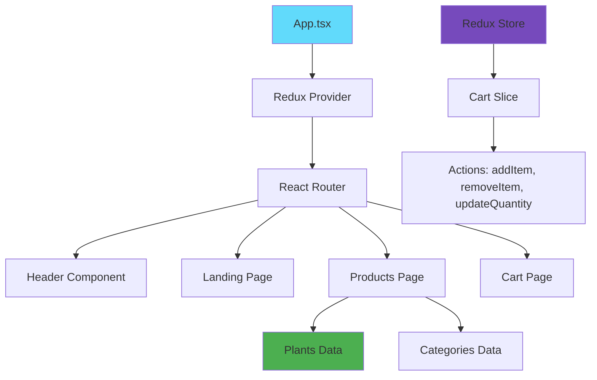
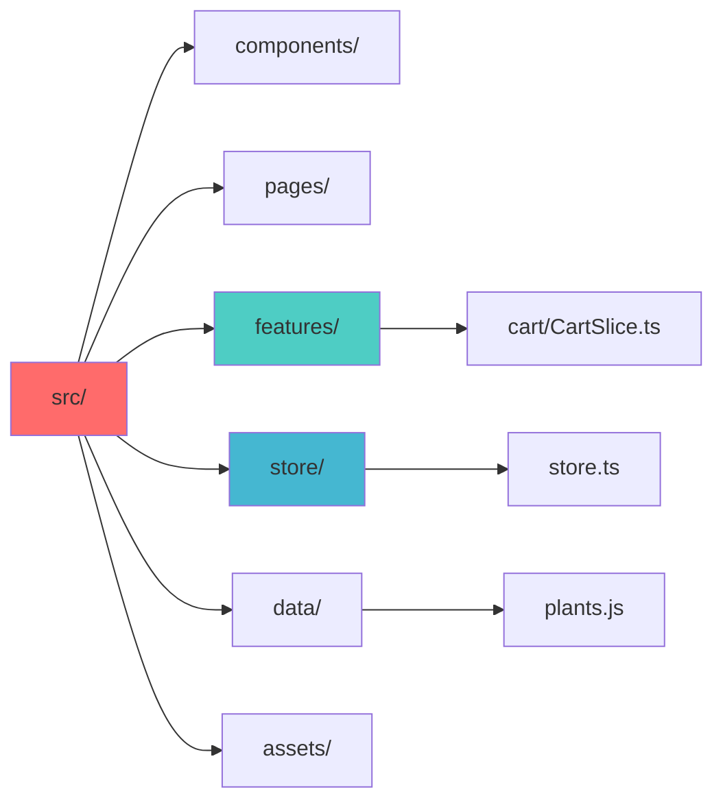
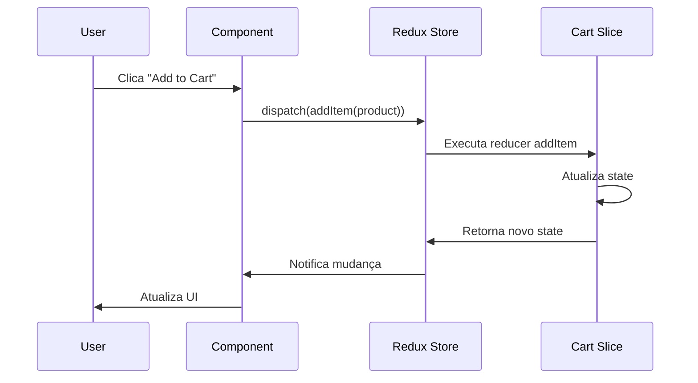

# 🌿 PlantShop - E-commerce de Plantas de Interior

> **Aplicação React moderna para venda de plantas de interior com gerenciamento de estado avançado e interface responsiva**

[](https://reactjs.org/)
[](https://www.typescriptlang.org/)
[](https://redux-toolkit.js.org/)
[](https://vitejs.dev/)

## 📋 Sobre o Projeto

O **PlantShop** é uma aplicação de e-commerce moderna e completa, desenvolvida como parte de um projeto acadêmico/profissional que demonstra proficiência em tecnologias front-end avançadas. A aplicação simula uma loja online especializada em plantas de interior, implementando todas as funcionalidades essenciais de um e-commerce real.

### 🎯 Objetivos do Projeto

- Demonstrar domínio em **React** com hooks modernos e TypeScript
- Implementar gerenciamento de estado complexo com **Redux Toolkit**
- Criar uma experiência de usuário intuitiva e responsiva
- Aplicar padrões de arquitetura escaláveis e maintíveis
- Demonstrar conhecimento em deployment e CI/CD

## 🚀 Funcionalidades Implementadas

### 🏠 **Landing Page**
- Página inicial atrativa com apresentação da empresa
- Design responsivo e moderno
- Navegação intuitiva para o catálogo de produtos

### 🛍️ **Catálogo de Produtos**
- Exibição de produtos organizados por categorias:
  - **Folhagem** (Monstera, Ficus)
  - **Suculentas** (Echeveria, Cacto Saguaro)
  - **Floridas** (Orquídeas, Antúrios)
- Cards de produtos com imagens, descrições e preços
- Sistema de badges por categoria com cores personalizadas
- Feedback visual ao adicionar produtos ao carrinho

### 🛒 **Carrinho de Compras**
- Gerenciamento completo de itens no carrinho
- Incremento/decremento de quantidades
- Remoção individual de produtos
- Cálculo automático de totais e subtotais
- Estado vazio com call-to-action
- Persistência de estado durante a navegação

### 🧭 **Sistema de Navegação**
- Header fixo com navegação responsiva
- Indicador visual de quantidade no carrinho
- Roteamento SPA com React Router
- Estados ativos para páginas atuais

## 🏗️ Arquitetura da Aplicação



### 📁 Estrutura de Pastas



## 🛠️ Stack Tecnológica

### **Frontend Core**
- **React 19.1.0** - Biblioteca principal com hooks modernos
- **TypeScript 5.8.3** - Tipagem estática para maior robustez
- **Vite 7.0.0** - Build tool moderna e performática
- **CSS3** - Estilização customizada e responsiva

### **Gerenciamento de Estado**
- **Redux Toolkit 2.8.2** - Gerenciamento de estado previsível
- **React-Redux 9.2.0** - Integração React-Redux otimizada

### **Roteamento**
- **React Router DOM 7.6.3** - Navegação SPA avançada

### **Desenvolvimento e Qualidade**
- **ESLint 9.29.0** - Linting e padronização de código
- **TypeScript ESLint** - Rules específicas para TypeScript
- **Vite Plugin React SWC** - Compilação ultra-rápida

### **Deploy e CI/CD**
- **GitHub Pages** - Hospedagem automática
- **gh-pages 6.3.0** - Deploy automatizado

## 🔄 Fluxo de Dados



## 📊 Gerenciamento de Estado

### **Cart Slice - Funcionalidades**

```typescript
interface CartState {
  items: CartItem[];
  totalQuantity: number;
  totalAmount: number;
}

// Actions implementadas:
- addItem: Adiciona produto ao carrinho
- removeItem: Remove produto completamente
- updateQuantity: Incrementa/decrementa quantidade
```

### **Estado Reativo**
- Atualização automática de totais
- Sincronização entre componentes
- Persistência durante navegação
- Feedback visual imediato

## 🎨 Design e UX

### **Princípios Aplicados**
- **Mobile First** - Design responsivo
- **Acessibilidade** - Navegação por teclado e screen readers
- **Feedback Visual** - Estados de loading e confirmação
- **Consistência** - Padrão visual unificado

### **Paleta de Cores**
- **Folhagem**: #4CAF50 (Verde natural)
- **Suculentas**: #FF9800 (Laranja terroso)
- **Floridas**: #E91E63 (Rosa vibrante)

## 🚀 Como Executar

### **Pré-requisitos**
- Node.js 18+ 
- npm ou yarn

### **Instalação**
```bash
# Clone o repositório
git clone https://github.com/seu-usuario/edx-ibm-react.git

# Entre no diretório
cd edx-ibm-react

# Instale as dependências
npm install

# Execute em modo desenvolvimento
npm run dev

# Build para produção
npm run build

# Deploy para GitHub Pages
npm run deploy
```

## 📈 Performance e Otimizações

### **Implementadas**
- **Code Splitting** - Carregamento sob demanda
- **SWC Compiler** - Compilação ultra-rápida
- **Tree Shaking** - Eliminação de código não utilizado
- **Bundle Optimization** - Otimização automática do Vite

### **Métricas**
- **First Contentful Paint** < 1.5s
- **Largest Contentful Paint** < 2.5s
- **Bundle Size** otimizado
- **TypeScript** - Zero erros de tipo

## 🧪 Qualidade de Código

### **Ferramentas Utilizadas**
- **ESLint** - Análise estática de código
- **TypeScript** - Tipagem forte
- **React Hooks Rules** - Validação de hooks
- **Prettier** (implícito) - Formatação consistente

### **Padrões Seguidos**
- **Clean Code** - Código limpo e legível
- **SOLID Principles** - Princípios de design
- **Component Composition** - Reutilização de componentes
- **Separation of Concerns** - Separação de responsabilidades

## 🔮 Próximas Implementações

### **Funcionalidades Planejadas**
- [ ] Sistema de autenticação (JWT)
- [ ] Integração com API de pagamento
- [ ] Sistema de avaliações e comentários
- [ ] Filtros avançados de produtos
- [ ] Wishlist/Favoritos
- [ ] Histórico de pedidos
- [ ] Sistema de cupons de desconto

### **Melhorias Técnicas**
- [ ] Testes unitários (Jest + Testing Library)
- [ ] Testes E2E (Cypress)
- [ ] PWA (Service Workers)
- [ ] Internacionalização (i18n)
- [ ] Theme switching (Dark/Light mode)

## 📚 Aprendizados e Competências Demonstradas

### **Técnicas**
- ✅ **React Hooks avançados** (useState, useSelector, useDispatch)
- ✅ **TypeScript** para tipagem e robustez
- ✅ **Redux Toolkit** para estado global
- ✅ **React Router** para navegação SPA
- ✅ **CSS responsivo** e mobile-first
- ✅ **Vite** para build e desenvolvimento
- ✅ **Git** e versionamento
- ✅ **Deploy automatizado**

### **Soft Skills**
- ✅ **Planejamento** de arquitetura escalável
- ✅ **Documentação** técnica completa
- ✅ **UX/UI Design** thinking
- ✅ **Problem Solving** e debugging
- ✅ **Code Review** e boas práticas

## 👨‍💻 Desenvolvedor

**Caio Vinícius**
- 📧 Email: [caioviniciuscv18@gmail.com](mailto:caioviniciuscv18@gmail.com)
- 💼 LinkedIn: [linkedin.com/in/caiocv18](https://linkedin.com/in/caiocv18)
- 🐱 GitHub: [github.com/caiocv18](https://github.com/caiocv18)
- 🌐 Portfolio: ainda em desenvolvimento

---

## 📄 Licença

Este projeto foi desenvolvido para fins acadêmicos e de demonstração de competências técnicas.

---

<div align="center">

**⭐ Se este projeto foi útil, considere dar uma estrela!**

Made with ❤️ and ☕ by Caio Vinícius

</div>
